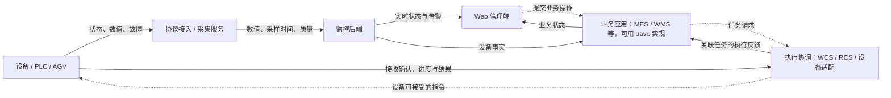
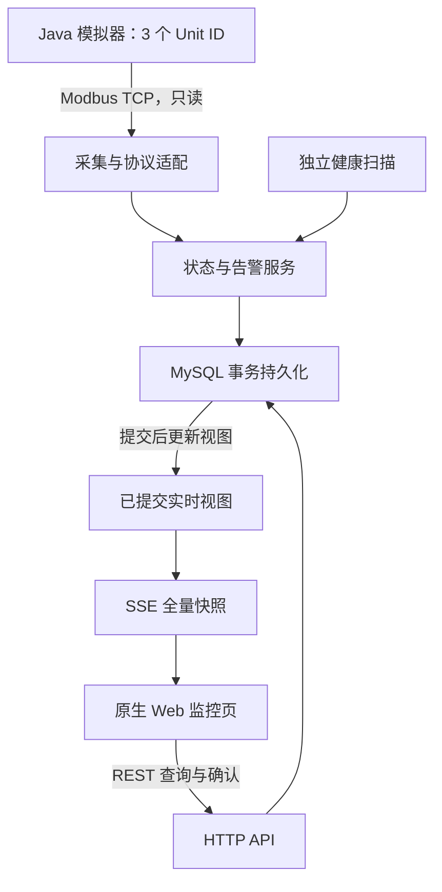

# 02 系统架构与关键行为

状态：下方 Demo 业务架构待实现；工程和学习进度见 [任务交接](06-tasks.md)。默认参数见 [需求](01-requirements.md)，协议见 [寄存器表](10-modbus-register-map.md)。

## 0. 工业系统全景与本项目的位置

本节面向已有 7 年 Java 互联网开发经验、正在学习工业领域的开发者。先理解系统职责，再把接口、并发、事务和状态机经验迁移到设备场景。全景属于拓展理解；本项目工程范围仍是模拟 AGV 的只读采集监控。

### 0.1 各方负责什么

| 对象 / 系统 | 主要职责 | Java 后端需要理解的边界 |
| --- | --- | --- |
| 工厂设备、传感器与 PLC | 设备执行物理动作；传感器测量；PLC 执行控制逻辑并与现场信号交互 | PLC 是控制器，不是协议；业务服务不能把一次接口成功当成物理动作完成 |
| AGV / AMR | 结合自身控制与导航能力执行移动和搬运动作 | 接入方式取决于厂商；本项目的寄存器映射不是通用 AGV 接口 |
| 边缘网关 / 采集服务 | 接入设备、解析协议、整理数据并向上提供；是否缓存取决于具体实现 | 可能独立部署，也可能是后端内部模块；Demo 使用后端内的采集模块，不另建网关进程 |
| HMI / SCADA | 人机交互、监视、数据采集及相应的监控操作 | 与本项目监控主题相关，但 Demo 不具备完整 SCADA 产品能力 |
| MES | 管理制造执行过程，如工单、工序执行、生产进度、质量与追溯 | 需要把设备事实关联到生产业务；仅有设备在线和速度数据不足以证明工序完成 |
| WMS | 管理仓储作业，如库存、库位、入库、拣选和出库 | 库存业务变化与设备动作反馈需要关联和核对，不能只凭车辆到站就扣减库存 |
| WCS / RCS / 车队调度 | 仓储设备执行协调或机器人任务分配、路径与交通协调等 | 名称及职责划分随产品而异；Java 业务系统与其交换任务和结果，不代表亲自实现运动控制 |
| Java 后端与 Web 管理端 | 实现业务规则、系统集成、状态保存、查询与操作入口 | Java 是实现技术，可用于 MES/WMS、集成服务或监控系统；Web 是交互入口，不是另一层设备协议 |

MES 的生产管理职责参考 [Inductive Automation 的 MES 说明](https://inductiveautomation.com/resources/article/what-is-a-manufacturing-execution-system-mes)；仓储职责参考 [SAP 的 WMS 说明](https://www.sap.com/resources/what-is-a-warehouse-management-system-wms)。[SAP 的 WMS 外部系统接口](https://help.sap.com/docs/SAP_S4HANA_ON-PREMISE/9609b5f9e9304ef6850945b359a1f5d4/5728bd534f22b44ce10000000a174cb4.html)提供了仓储系统与执行设备系统协作的具体例子。以上用于理解职责，不能当成所有工厂都遵循的部署拓扑。

### 0.2 数据上报与任务下发

下图是学习用的协作示意。实线表示设备数据上报、查询与展示，虚线表示任务或指令方向；虚线链路仅作领域讲解，Demo 不实现。业务反馈可以经专用接口或消息返回，不能用一次遥测采样代替任务回执。

本项目实际覆盖“模拟器 → Modbus 采集 → 监控后端 → 数据库与页面”，详见下一节 Demo 架构。MES/WMS、控制和调度不因为出现在全景图中就成为待实现模块。

### 0.3 贯穿案例：产线补料

以下是为学习构造的一种业务方案，具体系统分工应以实际项目约定为准。

1. **生产提出需求**：某工单在某工位需要物料，生产侧形成补料需求。工单表示一项生产安排，工序表示加工步骤，工位表示执行位置；它们都不同于设备通信地址。
2. **仓储组织出库**：WMS 根据物料、批次、库存及库位安排出库；形成的仓储任务需要关联原补料需求。库存预留、实际出库和到线确认是不同业务节点。
3. **执行系统安排搬运**：向执行协调系统提交关联业务编号的搬运任务，由其结合车辆和现场条件安排执行。接口具体支持什么操作，需要双方契约确认。
4. **设备执行并反馈**：接收任务、开始执行、到达位置、装卸完成可能是不同状态；反馈应关联到原任务，重复与晚到反馈不能重复推进业务。
5. **业务核对结果**：按约定证据确认物料交接，再推进库存或生产业务；超时、设备故障、任务取消等需要查询、核对或人工处置路径。

Demo 能提供设备连接、数据质量、电量、故障及历史，帮助判断设备是否可观察、定位异常发生时间。它没有物料、库存、工单或搬运任务数据，不能凭 `RUNNING`、位置编码变化或告警恢复宣称“补料完成”。本项目位置只是模拟编码，也不代表真实库位或地图坐标。

### 0.4 从 HTTP 数据到设备点表

设备台账回答“业务上是哪台设备、如何连接”；点表回答“从哪里读、如何解释”。本项目一台设备有 8 个固定寄存器，不新增通用点位配置平台。

| 熟悉的后端概念 | 工业接入中的对应问题 | 类比的局限 |
| --- | --- | --- |
| API 字段契约 | 点表中的地址、数据类型、单位、缩放、枚举和读写属性 | 寄存器中的整数不会自动携带 JSON 字段名或业务单位 |
| 资源 ID 与路由 | 业务编码与协议寻址之间的映射 | Modbus TCP 使用 Unit ID 等报文字段，没有 `/agv001` 这种 HTTP 路径 |
| DTO 校验 | 校验长度、范围、故障码与运行状态一致性 | 协议响应正确仍可能是业务非法值或陈旧数据 |
| updatedAt | 设备采样时间、后端接收时间、数据库更新时间 | 三者可能不同；Demo 的 sampledAt 是后端接受新样本的时间 |
| 服务健康检查 | 通信可达、数据是否更新、设备能否执行任务 | 这三个判断需要不同证据，不能用一个 ONLINE 全部代替 |

接入陌生设备前，应向设备方确认：设备型号及固件、支持的协议和版本、连接地址与访问许可、点表及 Unit ID 约定、功能码与地址基准、类型/字节序/单位、心跳和更新时间、错误码、读取频率限制，以及可用的联调环境。控制能力还需单独确认指令、回执及执行边界。本项目的具体答案以 [寄存器表](10-modbus-register-map.md) 为准；不能直接照搬到厂商设备。

### 0.5 协议学习深度

| 技术 | 需要理解什么 | 本项目学习 / 工程边界 |
| --- | --- | --- |
| Modbus TCP | 功能码、Unit ID、PDU 地址、uint16、缩放、响应匹配和超时 | 必须实践：读懂固定点表和字节样例，再验证真实 TCP；只读采集 |
| OPC UA | 信息模型、节点、类型、质量/时间及安全通信等概念 | 拓展理解：比较与固定寄存器映射的差异，不新增客户端 |
| MQTT | 经 Broker 发布/订阅、Topic、消息载荷及交付语义 | 拓展理解：传输层不定义设备业务含义；消息交付不等于物理动作完成，不部署 Broker |
| VDA 5050 | 车队控制与移动机器人之间的任务及状态交换约定 | 拓展理解：作为 AGV 接口的一种规范实例，不把它视为所有 AGV 默认支持的接口，不实现适配 |

协议依据分别见 [Modbus 官方规范](https://www.modbus.org/file/secure/modbusprotocolspecification.pdf)、[OPC Foundation 概念说明](https://reference.opcfoundation.org/specs/OPC-10000-1/full)、[OASIS MQTT 5.0](https://docs.oasis-open.org/mqtt/mqtt/v5.0/os/mqtt-v5.0-os.html)和 [VDA 5050 官方仓库](https://github.com/VDA5050/VDA5050)。本项目固定使用的寄存器、阈值和设备映射仍是自定义约定。

### 0.6 采集与控制的失败含义不同

只读采集失败可以在预算内重试，仍需控制并发、超时与资源释放。控制请求可能已被执行，但调用方没有收到反馈；这时直接重复发送，可能造成重复物理动作。讨论控制设计时，应区分以下证据：

| 阶段 | 能说明什么 | 尚不能说明什么 |
| --- | --- | --- |
| 请求成功 | 对端接口按契约返回成功，或传输层完成相应交互 | 指令一定被设备业务接受 |
| 指令被接收 | 对端识别并接受了关联任务 / 指令 | 设备已完成动作 |
| 动作完成 | 设备或执行系统按约定反馈动作结果 | 库存、物料交接等业务记录已核对完成 |
| 业务完成 | 业务服务按约定证据完成状态推进 | 所有外部系统天然同时一致 |

设计讨论需考虑任务标识、幂等支持、状态查询、回执关联、重复/乱序反馈以及结果不明时的核对或人工处置。不能假设厂商一定支持按任务 ID 去重。运动控制、安全互锁和急停等职责需由相应设备与控制系统承担，Java 业务接口不以自身事务提交替代这些保证。本节只作面试与设计练习，不添加控制 API 或写寄存器逻辑。

## 1. 架构

这是一个单实例业务后端，加一个设备模拟器进程。模拟器必须经 TCP 与后端通信，不能在后端内直接调用 Java 对象“伪装”协议接入。

## 2. 目标代码组织

| 路径 | 职责 |
| --- | --- |
| `pom.xml` | Maven 父项目，聚合 backend、simulator 两个模块 |
| `backend/` | Spring Boot 业务单体和静态页面 |
| `backend/.../device/` | 设备配置与校验 |
| `backend/.../collector/` | 调度、超时、连接生命周期、Modbus 适配 |
| `backend/.../monitoring/` | 状态、数据质量、健康扫描 |
| `backend/.../alarm/` | 告警判定与生命周期 |
| `backend/.../history/` | 历史采样与查询 |
| `backend/.../stream/` | SSE 客户端管理与推送 |
| `backend/src/main/resources/db/migration/` | 增量数据库迁移 |
| `backend/src/main/resources/static/` | HTML/CSS/JavaScript |
| `simulator/` | Spring Boot 小型模拟器：Modbus 服务 + demo 管理接口，无数据库 |
| `scripts/` | 可复现的验收脚本；不得默认清库 |

包名前缀建议 `com.example.agv`。路径中的 `...` 表示该模块 Java 包路径，不是实际目录名。

## 3. 采集流程

1. 调度器每 1000ms 扫描启用设备；已经 in-flight 的设备跳过。
2. 获得该设备本地 in-flight 标记，投递有界线程池；拒绝时释放标记并计数。
3. 通过 `DeviceClient.read(device)` 读取功能码 03、偏移 0、数量 8。
4. 协议响应必须匹配请求、长度正确。解码为自有 `DeviceSample`，不泄漏库类型。
5. 建连或读取失败最多一次重试；非法地址、数据越界等确定性问题不重试。
6. 本轮总预算最多 1800ms。超过预算须终止/关闭对应操作资源；不能仅取消 Future 却让底层连接无限等待。
7. 获得短时设备状态锁，校验该设备仍启用且配置 revision 没变，再合并结果。
8. 数据库事务保存快照、必要历史、状态事件和告警；提交后刷新实时视图。
9. `finally` 释放 in-flight；下一次调度继续尝试。离线不是永久停止采集。

同一设备始终至多一个网络采集；不同设备可以并行。连接优先复用，失败时关闭并按下次调度重建。选定库自带的重连与应用重试必须统一管理，不能叠加两套无限重连。

隔离边界：网络请求不持有数据库事务或设备短锁；健康扫描、启停操作使用同一设备短锁，使采集与告警判定串行。短锁内可以做这个小 Demo 的数据库事务，但不得等待网络 I/O。多实例不在当前正确性承诺内。

## 4. 通信状态与数据质量

### 4.1 时间与运行态字段

| 字段 | 更新时机 |
| --- | --- |
| `enabledAt` | 本次进程启动开始监控，或重新启用设备 |
| `lastResponseAt` | 收到结构完整、匹配请求的正常 Modbus 响应；业务值非法也记录 |
| `lastFreshAt` | 首次有效样本，或后续有效样本的 heartbeat 与上次不同 |
| `lastHeartbeat` | 接受新有效样本时更新 |
| `lastHistorySavedAt` | 10 秒历史采样写入并提交成功 |

协议异常响应、TCP 建连成功、空响应不刷新 `lastResponseAt`。数据库只保存墙上时间用于展示；运行期间超时判定用可替换的单调时间源，单测可控制时间。

### 4.2 状态转换表

| 事件 | 连接状态 | 数据质量 / 数值处理 |
| --- | --- | --- |
| 启用或后端重启 | UNKNOWN | 无历史为 UNKNOWN；有历史为 STALE，旧值只供参考 |
| 首个有效样本 | ONLINE | GOOD；保存数值、心跳及 lastFreshAt |
| 有效样本且心跳变化 | ONLINE | GOOD；推进业务快照 |
| 心跳暂时不变、未到 10 秒 | ONLINE | 保留最后有效数值与质量，不制造新业务样本 |
| 心跳不变达到 10 秒 | ONLINE | STALE；lastFreshAt 不变 |
| 正常协议响应但值非法 | ONLINE | INVALID；保留最后有效业务数值，不刷新 lastFreshAt |
| 一次通信失败但未到离线阈值 | 保持原连接状态 | 不立即下线；由健康扫描继续判定 |
| 无正常响应达到 10 秒 | OFFLINE | 有有效旧值则 STALE，否则 UNKNOWN |
| 停用设备 | DISABLED | 有旧值则 STALE，否则 UNKNOWN；停止后续采集 |
| 离线后收到正常但非法的数据 | ONLINE | INVALID；通信恢复不表示业务数据恢复 |

健康扫描每秒独立运行。没有历史响应时，以 `enabledAt` 为离线计时起点。先判断停用与离线，再判断数据陈旧；已有 INVALID 在新有效样本前保持 INVALID，除非连接转为离线。

heartbeat 使用 uint16 环绕计数；`65535 → 0` 是变化，也是新样本。重复 heartbeat 不更新业务值；首次采样没有“之前的 heartbeat”，必须接受。模拟器一次原子更新整块寄存器，避免一个样本读到一半新一半旧。

### 4.3 时间例子

在 t=0 收到最后一个正常响应；t=1 发生超时，不立即掉线；到 t>=10 的首次健康扫描，转为 OFFLINE。因此确定性测试 t=10 必须离线，本地手工演示容忍扫描和显示延迟，目标在最后响应后 10～12 秒看到变化。

如果响应仍正常但心跳冻结，则保持 ONLINE，并在最后一次心跳推进后 10～12 秒看到 STALE。

## 5. 事务和故障边界

- 一个短事务原子更新设备快照、应保存的历史、变化事件、告警。
- JDBC 事务通过独立服务 Bean 的公开入口或 TransactionTemplate 生效，避免内部调用绕过代理。
- 推送/更新已提交视图在提交后执行；回滚时不得推送“已成功保存”的状态。
- 通信计时与数据库成功提交分开：数据库失败不能被当成所有设备通信失联。
- 数据库不可用时记录持久化错误、readiness 返回不就绪；页面不能把旧数据当新值。
- MVP 不保证数据库故障期间不丢样本，不引入消息队列；恢复后保存新的实时数据，不伪造补齐缺口。
- 停用与采集并发时，以启用标记和 revision 校验屏蔽晚到结果，避免停用后又变 ONLINE。

## 6. 告警生命周期

业务是否仍异常，与用户是否已经确认，是两件独立的事。

| 状态字段 | 值 | 用途 |
| --- | --- | --- |
| `status` | ACTIVE / RECOVERED / SUPPRESSED | 异常仍存在 / 规则证明恢复 / 因停用终止观察 |
| `acknowledgedAt` | null / 时间 | 是否已确认；不改变 status |

- 新异常插入 ACTIVE，并占用 `(device_id, rule_code)` 活动槽。
- 相同异常持续时只更新 `lastObservedAt`，必要时更新 faultCode，不新增事件。
- 恢复时清空活动槽，写 `recoveredAt`；再次发生时创建新的告警 ID。
- 确认接口幂等：重复调用不改变首次确认时间，不创建新记录。
- 设备停用时 ACTIVE 改为 SUPPRESSED、记录 `closedAt` 和原因；重新启用后的异常是新事件。
- 后端重启从数据库恢复 ACTIVE 告警，不能仅靠丢失的内存 Map 去重。

## 7. 历史数据

- 快照：每台设备一行；正常情况下每秒刷新，是当前视图的持久副本。
- 采样历史：第一个有效新样本立即保存，之后距上次成功保存 >=10 秒才保存。
- 离散事件：连接、数据质量、运行状态或故障码变化时保存。心跳、位置和电量的每次变化不单独生成状态事件。
- 告警：有独立事件表，不靠扫描历史样本反推。
- STALE/INVALID 不制造新的趋势点；曲线或表格必须保留时间空缺。
- “只保存变化”无法提供均匀趋势，“保存每秒全部值”不是本项目默认，两者不能混写。

## 8. SSE 设计

采用每秒一次全量 `snapshot`：最多 10 台设备、最多 100 条 ACTIVE 告警，体量足够小。服务端首次连接立即发快照，之后发送最新已提交视图。心跳每 15 秒发送注释行。

使用 Spring MVC 的 `SseEmitter` 可以完成单向事件流；连接应有周期写入和错误/完成清理。参考 [Spring MVC 官方文档](https://docs.spring.io/spring-framework/reference/web/webmvc/mvc-ann-async.html)。

- 推送线程独立于采集线程，慢浏览器不阻塞采集。
- 客户端上限 20，每连接最多保留最新 2 个待发快照，溢出合并旧快照。
- 断开时清理 emitter、定时发送任务和缓冲；不能留下无限队列。
- 使用 `streamEpoch` + 递增 `sequence` 判断连接内的新旧快照。
- 浏览器重连后用新的全量快照覆盖；不实现 Last-Event-ID 历史重放。
- 页面显示连接提示和快照生成时间；SSE 中断时不能继续显示“实时正常”。
