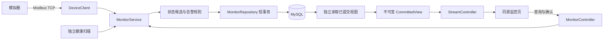

# 12 监控闭环：整体代码设计

状态：**P0/P1代码及分层工程验收已完成，包括30分钟系统检查；下一阶段集中学习**。日期：2026-09-14。

用户选择：“先根据文档完成整体的代码设计之后再根据文档来对我进行学习考察”。整体设计完成后继续按本文落实代码和验证，完成后集中讲解与考察；当前不恢复逐题学习门槛。下文现状和差距表保留设计时的基线，最新实施证据以 docs/06-tasks.md 和 docs/07-test-plan.md 为准。

## 1. 目标、范围与现状

交付一个可在本机演示的个人项目：三台模拟 AGV 经真实 Modbus TCP 上报，后端采集、判断状态、保存数据、维护告警，通过 REST/SSE 和页面展示。保持单实例 Spring Boot 后端、独立模拟器、MySQL 五表；沿用当前 Java 17、Maven Wrapper 和已锁定依赖。

初版设计覆盖T05～T13，并提前准备T19/T20材料。用户后续要求先完成全部代码，再学习；现补充第11节落实T14～T19，P0/P1验收均须完成。下表和第9节为初版设计时的差距记录，不能作为当前未完成清单。

| 部分 | 当前证据 | 本设计后的工作 |
| --- | --- | --- |
| 骨架、五表迁移、编解码、模拟器 | T01～T04 已有工程记录；T03 源码未提交 | 复用，执行相关回归 |
| Modbus 读取适配器 | 已有5个真实 TCP 测试通过报告 | 补齐协议头、取消和并发关闭边界 |
| 状态判断 | 已有7个可控时间单测通过报告 | 接入事务、启停、重启及完整采集流程 |
| 持久化、告警、REST、SSE | 已有初稿，业务集成验收尚未完成 | 按下述边界修正并完成真实集成测试 |
| 页面、Compose、验收脚本 | 尚无实现 | 在后端闭环后补齐并实测 |

本轮核对已有代码和报告，没有重新运行上述测试。源码存在、历史测试通过、完整闭环验收通过是不同状态。

## 2. 设计依据与冲突处理

- [需求](01-requirements.md)：P0 范围、阈值和容量的权威定义。
- [架构](02-architecture.md)：工业职责、状态转换和系统边界。
- [数据模型](03-data-model.md)：五表、索引和约束；已落地 V1 迁移不改写。
- [接口契约](04-api-design.md)：URL、JSON、分页、错误及 SSE 格式。
- [点表](10-modbus-register-map.md)：功能码03、地址0、数量8、字段校验与六种模拟场景。
- 本文细化代码职责、失败处理和实施顺序；第5节明确业务样本“接受”的提交边界，第7节明确 Unit ID 的 JSON 类型。审阅后将这些细化同步回对应契约，避免出现两套规则。

不新增业务接口、数据库表或依赖框架；不引入设备控制、MES/WMS、分布式采集或消息队列。

## 3. 模块职责与调用方向

| 类或代码区域 | 唯一主要职责 | 输入与输出 |
| --- | --- | --- |
| `protocol/` | 校验并转换八寄存器业务数据 | 16字节 ↔ 合法 `DeviceSample`；无网络与数据库 |
| `DeviceClient` / `ModbusTcpDeviceClient` | 连接复用、请求匹配、超时与读取结果分类 | `Device` → `ReadResult`；库类型不越过此边界 |
| `MonitorSettings` | 加载和校验统一业务参数 | 环境配置 → 共享不可变配置 |
| `DeviceState` | 根据输入、时钟和当前基准生成状态候选 | 正常/非法响应、健康扫描 → 候选状态；不直接写库 |
| `MonitorService` | 采集调度、每设备运行态、启停和事务编排 | 管理操作/读取结果 → 提交结果；统一设备锁和 revision 校验 |
| `AlarmRules` | 判断四类告警的动作 | 状态、新有效样本、活动告警 → OPEN / OBSERVE / RECOVER / SUPPRESS / NONE |
| `MonitorRepository` | 参数化查询、行锁与原子写入 | 状态候选和规则动作 → 已提交结果；不执行网络读取 |
| `api/` | 请求校验、显式响应 DTO 和错误映射 | 既定 REST 契约；不执行采集算法 |
| `StreamController` | 全量视图发送、保活、连接上限与清理 | 已提交视图 → SSE；不持有设备锁或数据库事务发送 |
| `static/` | 设备列表、详情、历史、告警和实时状态 | REST 查询/操作，SSE 覆盖实时视图 |

保留现有 `MonitorService` 的小型单体编排，不为每个类添加接口或另拆业务微服务。新增 DTO 使用 Java record；新增 `AlarmRules` 用于独立验证业务分支，不创建通用规则引擎。

## 4. 采集、并发与资源生命周期

1. 初始化完成后加载设备，以 `device_id` 建立运行态；连接目标来自数据库，不被种子配置覆盖。
2. 每1000ms扫描启用设备。每设备使用一个 in-flight 标记；繁忙时跳过，不堆积补采任务。
3. 使用4个工作线程和容量16的队列。排队任务开始网络操作前再次检查 enabled、revision 与关闭状态；队列拒绝时释放标记并记录计数。
4. 每设备复用一条连接；该演示规模不为共享 host/port 增加跨设备连接池。读取前生成唯一整轮截止时间。
5. 建连最多800ms，读取最多800ms，整轮预算1800ms。首次失败后最多重试一次，间隔100ms；发送前及每次等待前检查剩余预算。确定性协议错误与非法业务值不重试。
6. 校验 MBAP protocolId、transactionId、unitId、长度，以及响应功能码、字节数和业务字段。当前库未校验 Unit ID 的边界由已有适配器检查补足；不能仅依赖事务号。
7. 中断或超时后关闭对应通道并停止自动重连；取消 Future 不能替代关闭网络资源。晚到响应不再进入业务处理。
8. 接收结果后进入设备短锁，复查 revision 和 enabled，再生成状态候选和执行短事务。网络建连、等待、重试及 SSE 发送均不持有此锁。
9. finally 释放本轮 in-flight。离线设备仍按周期尝试恢复；关闭失败应记录，不能让重试或清理无限等待。

健康扫描使用独立调度线程，按单调时间计算10秒离线/陈旧阈值，不等待网络 Future。每个设备的扫描异常单独记录；一次异常不能让整个定时任务永久停止。

停机顺序：停止调度和新请求、终止在途读取、关闭连接、回收网络/定时/工作线程、结束 SSE 连接。所有资源归本应用实例所有；测试使用临时端口并验证关闭结果。

## 5. 三种状态与数据库失败边界

每设备区分以下三类数据，避免把通信成功当成保存成功：

| 数据 | 更新条件 | 失败处理 |
| --- | --- | --- |
| 通信事实 | 收到结构完整、匹配本请求的正常响应，包括业务值非法 | 立即记录本轮响应时间；数据库失败不抹掉该事实，也不据此判设备离线 |
| 业务状态候选 | 在设备锁内，从当前已接受业务基准计算新值、质量、告警和应写历史 | 使用副本；提交失败丢弃候选，不能让下一次健康扫描只补写它的快照而漏掉历史或告警 |
| 已接受业务基准与已提交视图 | 整个业务事务提交成功 | 更新业务心跳基准、有效样本时间、历史采样基准；视图随后由独立读取发布 |

**本设计明确：合法解码不等于业务样本已成功接受。** 新有效心跳以本进程最后成功提交的业务样本为基准判断；提交失败不推进该基准。下一次收到有效响应时重新判断，即便心跳与失败样本相同也可重新尝试。失败的历史不凭空补齐，不保留无界重试队列。

已有状态规则继续成立：INVALID 保留最后可信数值、不推进有效基准；短时心跳重复不立即 STALE；10秒无推进可 ONLINE + STALE；10秒无正常响应才 OFFLINE；未知测量为 null。数据库失败时对外显示 DEGRADED 和最后已提交数据。

重启加载旧业务值及其 `lastResponseAt/lastFreshAt` 展示时间，但运行态连接从 UNKNOWN 重新验证；旧值标为 STALE。单调计时基准不能从数据库墙上时间直接恢复。首次新有效响应可接受，即使心跳与重启前相同。

停用保留最后可信值及时间，连接改为 DISABLED，并原子抑制活动告警。重复停用不重复改 revision 或计时。重新启用建立新的观察起点；改名保留设备身份。

## 6. 事务、历史与告警

- 采集结果：一个外层事务锁定该设备快照行，读取已提交状态与活动告警，写快照、应保存的历史、离散事件和告警。
- 停用操作：同一外层事务更新设备配置、快照及活动告警；回滚时内存配置也不改变。
- 内部写入方法加入调用方事务，不自行启动嵌套重试。只有最外层在已完整回滚后，才对已识别的活动槽冲突最多重试一次，并重读数据库。
- 唯一冲突按约束区分：设备编码/连接重复返回409；历史 sample_key 重复按同一已保存样本处理；未知约束错误记录并报告，不能统一当作设备重复。
- 同一业务样本在事务重试中复用 UUID。首次有效样本保存历史，以后距最后成功保存至少10秒才保存；STALE/INVALID、失败样本和采样空缺不补零。
- 仅连接、质量、运行状态、故障码变化生成状态事件。电量、位置和心跳每次变化不制造状态事件。
- 低电量严格小于20触发，达到25恢复；20～24的有效新样本维持已有告警。非零故障码触发设备故障；OFFLINE 触发离线告警。
- 每设备每规则最多一个活动槽；持续异常更新最近观测，确认保留首次 acknowledgedAt 且不解除异常，恢复后再次出现使用新告警 ID。
- 无可信新业务样本不能恢复低电量/故障告警。停用改为 SUPPRESSED，而非 RECOVERED。活动告警从数据库恢复，不以内存 Map 是否存在决定新建。

事务等待设置上限，失败按设备记录。时间字段满足既有迁移的顺序约束；运行阈值使用单调时间，API 和持久化展示使用 UTC。

## 7. REST 与 SSE 的统一输出

沿用现有 `/api/v1` 路由、分页和错误格式，新增显式 DTO 映射，停止按数据库列名后缀猜测输出类型：

- 资源 `id/deviceId` 和版本 `configRevision/snapshotRevision` 为字符串。
- `unitId` 是协议地址，保持整数，与登记请求一致；port、heartbeat、故障码和位置也是整数。
- enabled 为布尔值，时间为 UTC ISO 8601，速度输出 m/s，未知测量保留 null。
- DTO 仅包含契约字段，不把内部 active_slot、sample_key 或数据库新增列自动暴露。
- 校验失败400、未知资源404、已识别冲突409、数据库连接/超时不可用503；未分类程序错误500。响应保留 traceId，日志与其关联；不返回堆栈、SQL或连接串。

全量实时视图采用一个不可变 `CommittedView`，包含设备和活动告警。独立刷新任务每秒在同一个数据库读取事务内取得两者，事务成功返回后一次替换视图引用。失败时保留完整旧视图并标记 DEGRADED，不发布部分更新。

视图刷新不持有设备短锁；HTTP 建连和 SSE 取缓存时不等待数据库。采集持久化失败与视图刷新失败分别记录，只有对应故障恢复才能清除降级标记。

SSE 保持一个 snapshot 事件、首次连接立即发缓存全量、每秒至多一次周期推送、15秒保活、20连接上限、每连接最多2个待发快照。使用 streamEpoch/sequence 拒绝过期帧，处理“初始帧与周期帧竞争”的乱序；重连覆盖全量，不回放历史。

连接关闭与发送任务注册的竞争也必须清理；发送失败关闭该连接，慢客户端不能占用采集线程。连接满或发送资源不足明确返回503。

## 8. 页面与部署

页面采用原生 HTML/CSS/JS，同源由后端提供，不引入前端构建框架或外部 CDN。

- 顶部显示实时连接状态、最后生成时间和采集降级提示。
- 主区展示设备列表，分别显示通信、质量、运行状态、电量、速度和最后有效时间。
- 详情区提供改名、启停、时间范围与分页历史/事件查询；未知值显示“—”，位置按 P0003 格式展示。
- 告警区支持设备/规则/状态筛选和确认；明确区分持续异常、已确认、已恢复与已抑制。
- 提供设备登记表单；错误就地显示。动态文本使用 textContent，避免注入。SSE 断线立即显示提示，不能继续显示实时正常。
- 模拟场景通过模拟器管理接口及演示脚本切换，不在监控页增加真实车辆控制入口。

Compose 使用 mysql、simulator、backend 三服务和独立命名数据卷。默认仅映射 `127.0.0.1:8080`；开发覆盖配置可发布本机8081/1502/3307。容器内服务监听允许容器网络访问的地址，通过服务名互联。

提供两个应用镜像、多阶段构建、非 root 运行、明确健康检查和 `.env.example`。镜像采用经拉取验证的 Java17 构建/运行版本及现有 MySQL 摘要，并记录最终引用；不使用浮动 latest。具体镜像摘要属于实施时验证结果，不提前编造。

验收脚本设置连接和总超时、失败返回非零；普通启停不删除卷。测试资源与个人数据库隔离，不自动 prune 或清库。

## 9. 现有初稿需要收敛的地方

以下为代码审阅发现，不声称已修复或已复现全部运行后果：

| 位置 | 当前差距 | 设计处理 |
| --- | --- | --- |
| `MonitorService.collect/persist` | 先修改运行态，提交失败后健康扫描可按非新样本路径重写 | 按第5节分离通信事实、业务候选与提交基准 |
| `MonitorService.start/patch`、`DeviceState` | 新建运行态仅携带旧测量，未保留旧展示时间 | 加载并保留可信测量及时间，单独重置本进程计时 |
| `MonitorService.refreshView` | 在事务回调内赋值两个列表，并与其他方法共用服务锁 | 事务返回后一次发布不可变视图；数据库刷新移到独立任务 |
| `MonitorRepository.persist` 与启停外层事务 | 当前写入入口自带重试，嵌套调用时事务边界不清晰 | 只在最外层进行完整回滚后的有限重试 |
| `MonitorRepository.rows` | 所有 `_id` 都转字符串，包含应为整数的 `unit_id` | 显式 DTO 和字段类型校验 |
| `ApiErrors` | 未识别的唯一冲突也映射为连接重复；缺统一500响应 | 按已识别约束映射，其余错误有独立处理与 traceId |
| `StreamController` | 初始/周期帧和注册/关闭存在并发窗口 | 单调序号、幂等清理及并发回归 |
| 后端集成验证 | 尚无完整采集→事务→告警→HTTP/SSE 验收 | 补真实 MySQL 和 TCP 组合测试，再进行 Compose/浏览器验收 |

## 10. 实施顺序与完成标准

1. **后端状态闭环**：修正候选状态、事务边界、API 映射和视图发布；补纯告警规则及相关单测。保留现有协议与模拟器。
2. **真实集成**：连接真实测试 TCP 服务和隔离 MySQL，验证采集、启停、回滚、告警、查询和 SSE。按失败原因修复，不跳过用例。
3. **页面与启动**：完成同源页面、Compose、模拟场景脚本、烟测和正常重启验证。
4. **面试交付**：基于实际结果更新 README、任务状态、验收记录、90秒介绍、3～5分钟演示和8个核心问答；未验证能力不写成已实现。

验收沿用 [A01～A25](07-test-plan.md)，另补以下防回归场景：

- 事务号正确但 Unit ID 错误、非零 protocolId、短帧/多余字段、晚到响应及关闭资源。
- 队列拒绝、排队期间停用、在途停用后重新启用、单台读取慢时其他车继续更新。
- 9.999秒与10秒、首次心跳0、65535回绕、冻结、非法业务值、重启保留历史时间。
- 合法样本写库失败：通信时间仍有效；可信业务基准不提前推进；无假历史/告警/视图；下一次同心跳有效响应可重试。
- 外层事务回滚、活动槽并发冲突、sample_key 重复、重复确认、恢复后新告警、掉线不恢复业务告警。
- JSON 的字符串资源ID与整数 Unit ID、布尔 enabled、UTC、小数速度、null、分页/时间边界和统一错误格式。
- SSE 一致视图、刷新失败保留旧视图、初始帧竞争、关闭竞争、重连与资源上限。
- 本机新卷启动、保留卷重启、三设备页面变化、告警确认/恢复与断线提示。

后端测试每条命令最多60秒，必要时按类分批执行；真实网络超时记录实测耗时及允许的调度误差。编译、单测、真实协议、数据库、浏览器和部署证据分别填写。本文是整体设计及验收依据，工程任务和学习状态均不因设计生成或局部测试通过而自动通过。

## 11. P1增强的最终实现

复用现有Micrometer、JDBC、Java执行器和浏览器脚本；不新增表、规则框架或依赖服务。

- **数据陈旧告警**：沿用`AlarmRules`与既有活动槽。只有ONLINE + STALE，且最近一次合法响应确实重复已提交心跳才触发DATA_STALE；单独保存通信侧`repeatedHeartbeat`，避免数据库失败造成基准未推进时误报设备冻结。INVALID、OFFLINE和重启旧值不触发/恢复；新的GOOD提交恢复，停用抑制。使用既有WARNING严重级别。
- **7天历史保留**：`HistoryRetention`在应用就绪1秒后执行首次清理，此后每次执行结束间隔24小时。每轮固定UTC截止时间，每批按`sampled_at,id`删除最多1000行，各批独立短事务。截止时间相等的行保留；不动设备、快照、状态事件及告警。批失败回滚、记录日志与计数，下一日继续；停止时中断并有界等待执行器结束。按日清理意味着保留窗口近似7～8天，故障时可更长。
- **运行指标**：采集整轮网络耗时按结果分类；跳过区分设备繁忙和队列满。另提供持久化/视图错误、队列/在途/工作线程数、SSE连接/积压/丢弃旧帧及清理行数/失败计数。标签不含设备ID，避免设备数量增长带来指标基数膨胀。计数随进程重启归零，不充当审计记录。
- **数据库故障**：保留连接池5秒获取上限，补驱动建连1.5秒、socket读2.5秒和语句3秒上限；各层限制不同，不能相加宣称一个固定事务耗时。数据库不可用时REST明确503、readiness失败、liveness仍可用，SSE保持完整已提交缓存并标记DEGRADED。恢复后重新提交当前观测，停库期间历史不补造。
- **SSE背压**：20个发送线程与每连接2帧队列保持不变，慢读合并旧帧。MVC完成异步初始化后才释放发送线程，阻止`SseEmitter`初始化前的内部缓冲绕过队列上限。连接使用60秒异步生命周期，客户端重连获取全量；网络发送不持有采集设备锁。真实慢读测试加速推送以制造背压，不能把测试频率当生产默认。
- **验收方式**：MySQL/TCP集成验证清理边界和陈旧告警，HTTP测试与实际慢读套接字验证SSE，Playwright验证页面；`scripts/system-check.py`以独立Compose项目实施数据库暂停/重启、应用重启和30分钟采集观察，报告保留镜像ID及每30秒样本。长时系统检查不并入60秒Maven批次。

增强只覆盖当前单实例、3台模拟车的可复现范围。固定队列、短事务和半小时观察不证明大规模容量、全天候稳定性或生产SLA。
